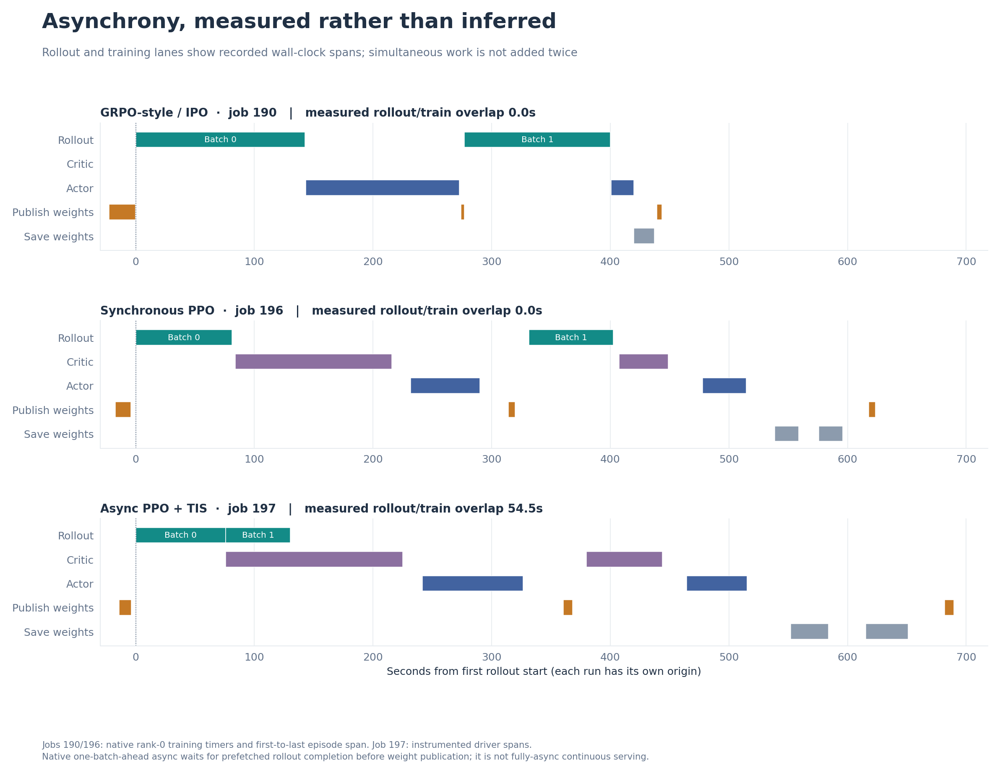
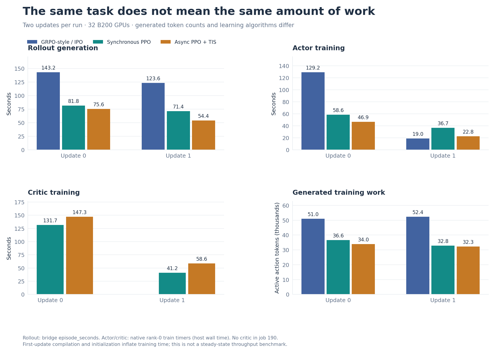
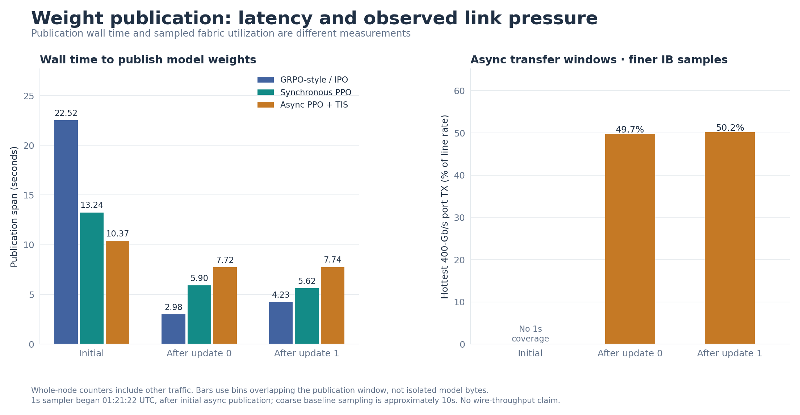
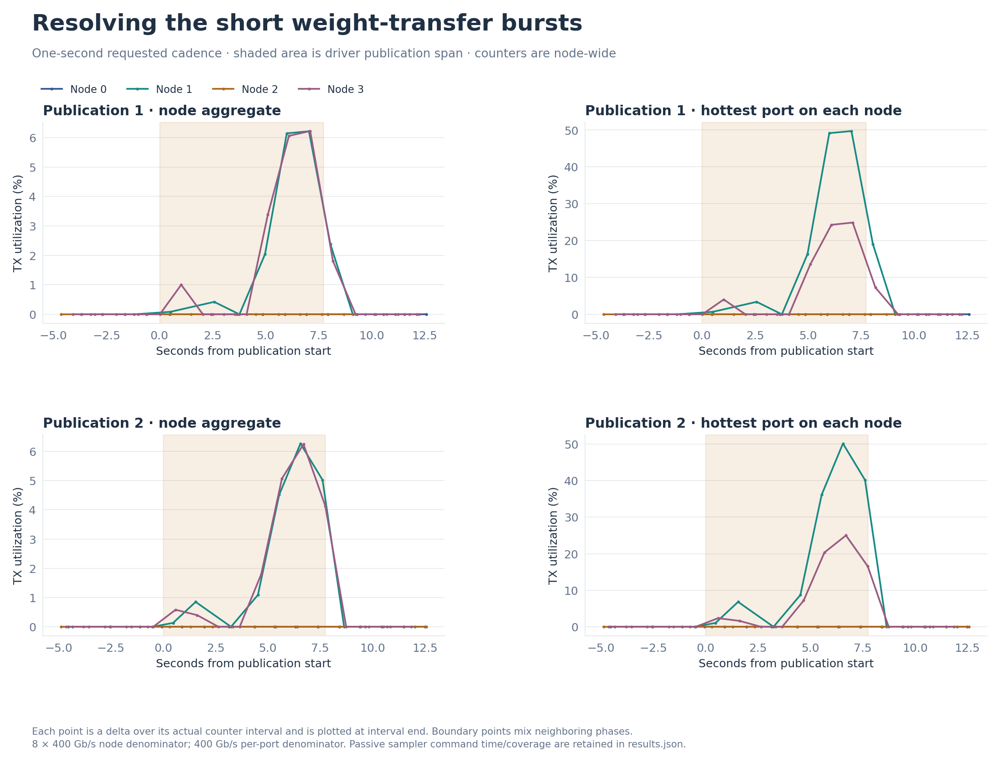
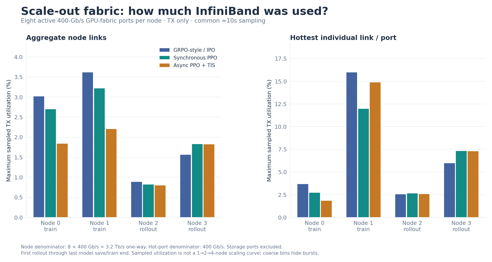
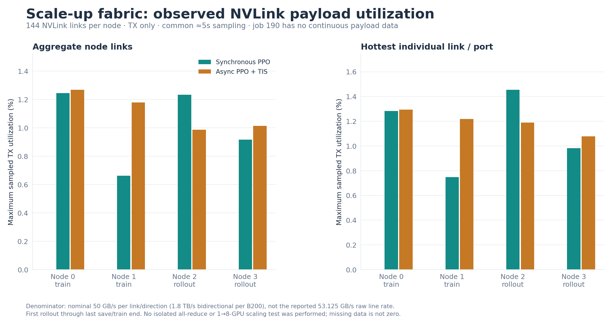
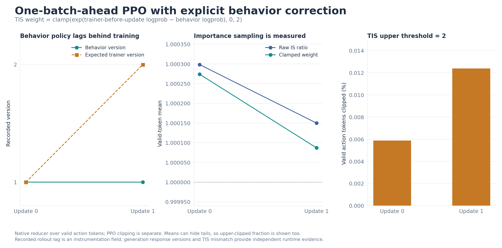
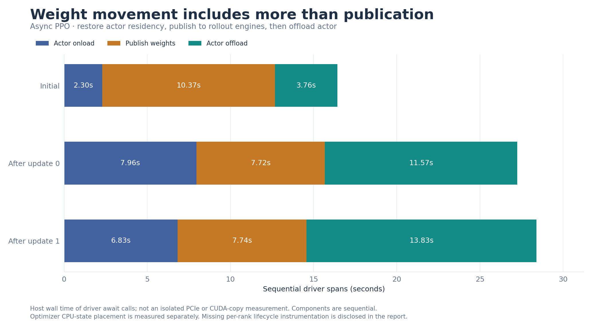
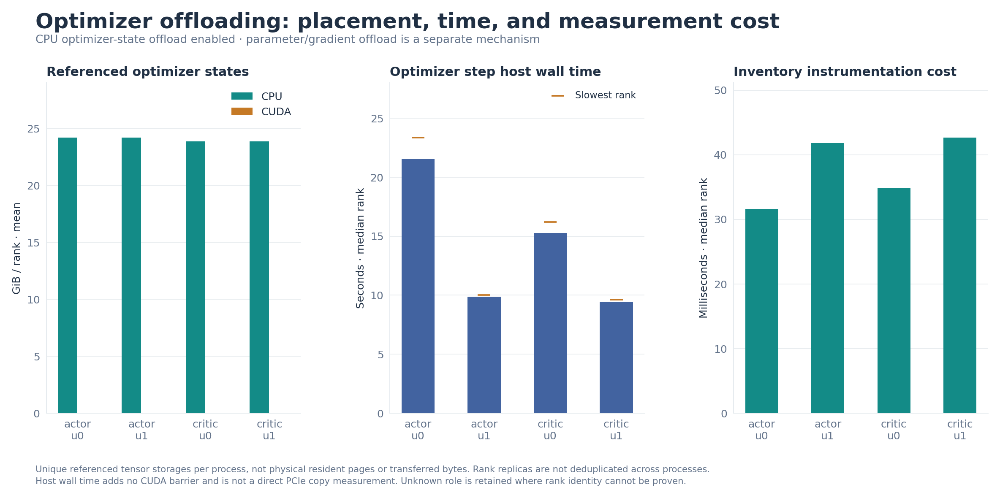
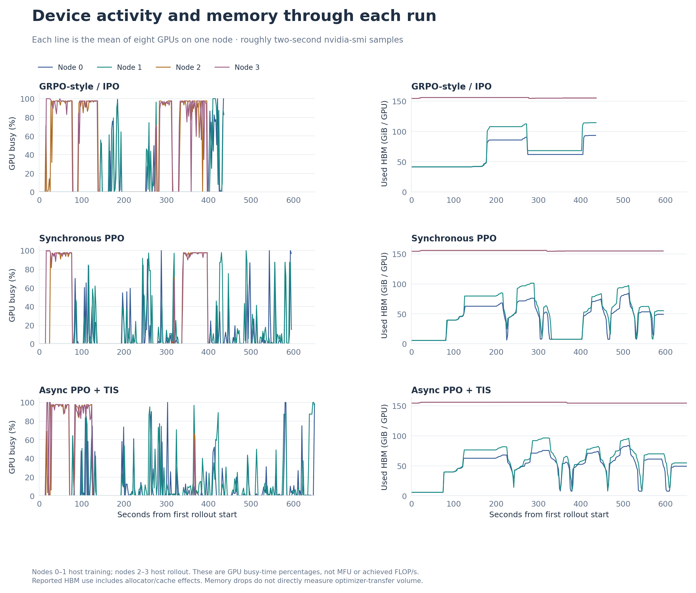

# Miles runs: execution and infrastructure evidence

**Three two-update experiments, the same fixed four-node configuration.** This report distinguishes measured workload utilization from an unperformed scaling benchmark. Startup scripts, raw logs and binary checkpoint locations are preserved.

## Did the runs finish?

- **Job 190 · GRPO-style / IPO:** Slurm `COMPLETED`, scheduler exit `0:0`, training exit `0`; 2 recorded updates. Work window 437.05 s (first rollout through last recorded save/train end). Rollouts 143.21 / 123.55 s; active action tokens 51,030 / 52,362.
- **Job 196 · Synchronous PPO:** Slurm `COMPLETED`, scheduler exit `0:0`, training exit `0`; 2 recorded updates. Work window 595.99 s (first rollout through last recorded save/train end). Rollouts 81.84 / 71.41 s; active action tokens 36,607 / 32,795.
- **Job 197 · Async PPO + TIS:** Slurm `COMPLETED`, scheduler exit `0:0`, training exit `0`; 2 recorded updates. Work window 650.96 s (first rollout through last recorded save/train end). Rollouts 75.64 / 54.41 s; active action tokens 33,987 / 32,283.

Job 190 is a GRPO-style credit assignment with the custom IPO objective, **not standard GRPO**. Job 195 was cancelled after an invalid uniform-policy actor step and is excluded from valid-run comparisons; its evidence remains in `run2-ppo/attempts/`. Jobs 196/197 retain the CPU parameter-backup and resident-broadcast fixes, start from the same original model, and reject invalid behavior logprobs.

Both PPO runs have finite nonzero actor and critic gradients. Structural checkpoint checks and small CPU tensor reads verify saved actor/critic weights; these are **weights-only checkpoints, not a full optimizer/RNG resume test**. See [verification.json](verification.json) for exact checks.

Lifecycle warnings are not hidden: startup `/freeze_gc` connection-refused retries preceded successful generation. Job 196 logged SGLang/Gloo peer-reset errors after final checkpointing/weight publication during teardown, while the training process and Slurm allocation exited successfully. Interpret shutdown stack traces in their timestamp context. Any corresponding job-197 warnings are recorded in verification, not silently discarded.

## What was held constant?

- Qwen3.6-35B-A3B; pinned Miles `70b89e11770fc9bac984e22cfff89c51cca44203`; Megatron trainer; identical Terminal Lego four-task cycle and task code.
- Two updates, batch 16, group size 8, max context 8,192, max response 2,048, eight turns. No continuation from the preceding trained checkpoint.
- Four assigned worker nodes, eight B200s each. Nodes 0–1 train actor/critic; nodes 2–3 serve rollouts. Rollout TP16, attention DP2, EP16; trainer TP1, EP8.
- Node inventory reports two AMD EPYC 9575F sockets / 256 logical CPUs, about 3,170,218,620 KiB RAM on node 0, 183,359 MiB reported HBM per GPU and a 1,000 W GPU power limit. Driver 595.71.05 reports CUDA 13.2 capability; this is not a claim about every library runtime version. Per-node raw inventories preserve differences.

The algorithms, generated trajectories, token counts, first-use compilation and cache state differ. Async PPO also recomputes trainer-reference logprobs rather than reusing rollout logprobs, adding work required for correct TIS; it has extra observational instrumentation. Total runtime is not a controlled algorithm speedup or quality comparison. Only two updates were run; no confidence intervals or convergence claims are justified.

## How much rollout work overlapped training?

Job 197 measured **54.49 seconds** of rollout/training overlap, counting simultaneous actor/critic spans only once. Native one-batch-ahead scheduling prefetches the next batch while the current batch trains and waits before publishing new weights. It is not the separate persistent-worker `--fully-async` implementation.





## Are weight transfers saturating scale-out bandwidth?

The latency and link-pressure figures answer different questions: elapsed publication time includes implementation/control work, while port counters measure all node traffic. We do not divide an assumed model size by publication time and label the result wire bandwidth.

- Job 190 publication spans, initial / after update 0 / after update 1: **22.52 / 2.98 / 4.23 s**.
- Job 196 publication spans, initial / after update 0 / after update 1: **13.24 / 5.90 / 5.62 s**.
- Job 197 publication spans, initial / after update 0 / after update 1: **10.37 / 7.72 / 7.74 s**.





Fine collector coverage: 2,612 samples; collection wall time median 0.486s / p95 1.915s / max 13.292s (not CPU time). There were 113 NVLink query failures/timeouts, concentrated on training nodes, and no IB query errors. Missing NVLink samples are not zero-filled; later counter deltas span the actual gap. Publication-window intervals were approximately 1.2–2.3s despite a requested 1s cadence.

The 1s requested-cadence sampler began at **2026-09-04 01:21:22 UTC**, so it does not cover the initial async publication. Actual sampling intervals, time spent collecting each sample, missing bins and counter resets are retained. The first sampler attempt at 01:17:04 failed immediately due to a script syntax error; the corrected v2 was smoke-tested and all four streams verified. Both attempts are preserved. This was a measurement-setup error, not a training/cluster failure.



- Job 190 common ≈10s sampler: hottest GPU-fabric port **15.98%**, busiest node aggregate **3.62%** of nominal one-way capacity during the reported work window.
- Job 196 common ≈10s sampler: hottest GPU-fabric port **11.97%**, busiest node aggregate **3.21%** of nominal one-way capacity during the reported work window.
- Job 197 common ≈10s sampler: hottest GPU-fabric port **14.88%**, busiest node aggregate **2.20%** of nominal one-way capacity during the reported work window.

Job 197's finer sampler observed up to **49.72%** on an individual 400-Gb/s IB port across its covered work window (not necessarily a weight-transfer phase). Compare publication-only bursts above, and do not rank runs using different sampling cadences.

**These observations do not establish a network ceiling or scaling efficiency.** No 1→2→4-node sweep, isolated network benchmark or fixed-token strong/weak scaling test was run. A busy individual port can be hidden by averaging eight ports; the report shows both. Coarse bins can also hide sub-second saturation.

## How much scale-up NVLink bandwidth was used?



The scale-up chart is measured payload utilization during training, not a GPU-count scaling curve. Job 190 lacks continuous NVLink data counters and is omitted, not assigned zero. Node aggregate and hottest-link views use the same ≈5s telemetry for jobs 196/197. The finer async counter stream is also preserved in results.

## Is the async run really off-policy, and is TIS active?

- Update 0: recorded policy lag **0**, served weight versions `['1']`; mean raw IS ratio **1.000298**, mean clamped weight **1.000274**, upper-clipped fraction **0.005885%**, actor gradient norm **1.275102**; mean absolute trainer/behavior logprob mismatch **0.008945**.
- Update 1: recorded policy lag **1**, served weight versions `['1']`; mean raw IS ratio **1.000150**, mean clamped weight **1.000087**, upper-clipped fraction **0.012390%**, actor gradient norm **1.242061**; mean absolute trainer/behavior logprob mismatch **0.015160**.



The correction is `clamp(exp(trainer_before_update_logprob − recorded_behavior_logprob), 0, 2)` with detached reference logprobs. PPO still applies its separate clipped new-policy/trainer-before-update ratio. Removing `--use-rollout-logprobs` prevents double-counting behavior correction. The active-token mask excludes observations and tool output. Version lag zero can still have small numerical backend mismatch; lag one does not imply large IS weights after a single small update. With one actor optimizer step per batch, the new-policy/reference PPO ratio is evaluated before that step, explaining PPO KL = 0 and ESS = 1 in these async logs; those values do not negate the separate nontrivial behavior-policy correction. Means do not reveal the complete ratio distribution; no histogram is fabricated from means.

Legacy synchronous sample metadata `policy_version` was the rollout ID, **not** a measured serving weight version. It is not reused as proof of staleness. Native per-token reduction is enabled; report scalars use the framework’s valid-token reduction.

## What happened to optimizer state and model offloading?





- Actor update 0: 16 optimizer rank records; mean referenced state **24.21 GiB CPU / 0.00 GiB CUDA per rank**; median / slowest step **21.519 / 23.377 s**.
- Actor update 1: 16 optimizer rank records; mean referenced state **24.21 GiB CPU / 0.00 GiB CUDA per rank**; median / slowest step **9.862 / 10.013 s**.
- Critic update 0: 16 optimizer rank records; mean referenced state **23.85 GiB CPU / 0.00 GiB CUDA per rank**; median / slowest step **15.284 / 16.193 s**.
- Critic update 1: 16 optimizer rank records; mean referenced state **23.85 GiB CPU / 0.00 GiB CUDA per rank**; median / slowest step **9.448 / 9.632 s**.

Optimizer storage sizes are unique *referenced storages per process*, not physical resident host pages, unique global parameter bytes or PCIe transfer volume. CPU Adam-state placement is separate from TMS model parameter/gradient offloading. Driver actor onload/offload spans are retained independently of publication time.

**Instrumentation gap:** the per-rank sleep/wake/update wrapper was installed but produced no lifecycle records in this runtime. The existing native structured logs do contain a subset of rank/role-labelled sleep/wake durations; these are preserved in results, but their 0.1s printed precision and Ray log deduplication prevent a complete rank distribution. Driver-level onload/offload and optimizer-step records did work. Optimizer rows record `role=unknown`; native training-log labels are joined by host/PID to recover the role. If absent, role is inferred only from one unambiguous enclosing serialized driver call; the assignment basis is retained in results. Host timers add no CUDA synchronization and are not direct copy-engine timings.



## Units, denominators and coverage

- InfiniBand PMA data-counter deltas are multiplied by **4 bytes**, then divided by actual elapsed time. [NVIDIA port-counter definitions](https://docs.nvidia.com/networking/display/ufmsdnappumv4184/appendix%2B%E2%80%93%2Bsupported%2Bport%2Bcounters%2Band%2Bevents) document the four-octet units.
- NVLink `nvidia-smi nvlink -gt d` data counters are **KiB**, multiplied by 1,024. These are payload counters, not raw traffic. [NVIDIA SMI documentation](https://docs.nvidia.com/deploy/nvidia-smi/index.html) defines both counter modes.
- GPU scale-out denominator: eight active 400-Gb/s IB ports per node, **3.2 Tb/s one-way**; 100-Gb/s storage ports are excluded. TX and RX are never summed against a one-way denominator. Incomplete node counter groups become null, not zero.
- Scale-up denominator: nominal **1.8 TB/s bidirectional per B200**, 18 links → 50 GB/s per link/direction, or 7.2 TB/s node TX across eight GPUs. [NVIDIA’s NVLink 5 description](https://developer.nvidia.com/blog/inside-nvidia-blackwell-ultra-the-chip-powering-the-ai-factory-era/) supplies the nominal rate and link count. Hardware status instead reports 53.125 GB/s raw per-link line rate; the FEC-adjusted `-dr` query is unsupported by the installed driver. Neither is a measured application ceiling.
- Common collectors: ≈2s GPU/host, ≈5s NVLink, ≈10s IB and SGLang Prometheus. Requested cadence is not substituted for actual time. Missing/reset/error intervals are counted; `lctl` unavailable means missing Lustre metrics, not zero storage traffic.
- Comparative bandwidth window: first rollout start through last recorded train/save end. Initial setup and final publication may lie outside it; publication-specific charts use their own overlapping bins. Fine/coarse publication bins include boundary traffic and cannot isolate model bytes.
- GPU busy percentages are not model FLOP utilization. HBM changes do not measure optimizer copy volume. Reported peaks are sampled interval averages, not instantaneous maxima.

## Reproduce and inspect

**Startup scripts are essential.** Each run’s `scripts/README.md` documents its frozen launcher; do not replace those files with reporting helpers.

- [Run 1 sources and evidence](../run1-grpo/README.md) · [Run 2 sources and final evidence](../run2-ppo/README.md) · [Run 3 async sources and final evidence](../run3-async-ppo/README.md).
- [Derived metrics and input SHA-256s](results.json), [completion/checkpoint verification](verification.json), [exported PNG/SVG figures](charts/), [analysis tests](test_analysis.py).
- Binary checkpoints and complete remote runs remain on the shared filesystem. Git contains bounded text evidence and plots, not model weights, kubeconfigs or credentials. Earlier run snapshots are preserved.

```bash
python3 -m unittest discover -s comparison-infrastructure -p "test_*.py" -v
python3 comparison-infrastructure/analyze.py \
  --run 190 "GRPO-style / IPO" evidence-job-190/job-190 \
  --run 196 "Synchronous PPO" run2-ppo/logs/job-196-final \
  --run 197 "Async PPO + TIS" run3-async-ppo/logs/job-197-final \
  --output comparison-infrastructure/results.json
python3 comparison-infrastructure/verify_results.py
python3 comparison-infrastructure/render.py comparison-infrastructure/results.json
python3 comparison-infrastructure/write_report.py
```

Plot dependency: Matplotlib 3.9.4 (NumPy 2.0.2 in the rendering environment). Analysis uses Python’s standard library. `capture_fabric_1s.py` is the corrected read-only sampler; failed/v2 launch records document its coverage. Validation programs are post-run tools, not changes to the training sources.
