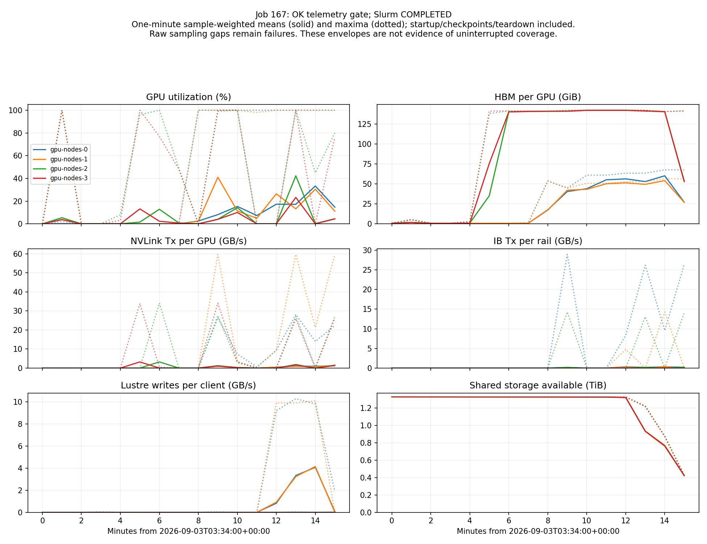

# Job 167: four-node GRPO validation

**COMPONENT_VALIDATION_ONLY** — Slurm COMPLETED (0:0). 2 optimizer updates and 2 save receipts verified.

## Accounting

- 32 selected native samples; tensor audit findings: 0.
- 48 controller episodes; 0 unjoined episodes and 0 unresolved dispositions.
- Environment audit findings: 0.

| Population | Samples | Passed episodes | Environment-seconds |
|---|---:|---:|---:|
| selected_for_training | 32 | 23 | 358.22 |
| sync_unused_discarded | 16 | 10 | 147.19 |

Zero-variance GRPO groups: 1. These are clean training-task outcomes, not TB2.1 evaluation.

## Audit findings

No findings in these component audits. Full benchmark gates remain open.

Pinned-backup cleanup: 16 completed rank receipts, 423,352,733,696 tensor bytes released; 0 findings.

Native telemetry: 3,378,085 records; 0 collector errors.

| Node | Maximum GPU sampling gap (s) |
|---|---:|
| gpu-nodes-0 | 3.005 |
| gpu-nodes-1 | 3.338 |
| gpu-nodes-2 | 2.152 |
| gpu-nodes-3 | 2.276 |

Actor placement: 166 snapshots; 0 findings.

| Node | Actor class | Count |
|---|---|---:|
| gpu-nodes-0 | MegatronTrainRayActor | 8 |
| gpu-nodes-1 | MegatronTrainRayActor | 8 |
| gpu-nodes-2 | SGLangEngine | 1 |
| gpu-nodes-3 | SGLangEngine | 1 |

## Infrastructure time series

## Runtime warnings

- SGLang logged 2 post-warmup freeze_gc failures. Retained as runtime warnings; no configuration was changed to suppress them.

### Slow NVML calls

| Node | API | Duration (s) | UTC start |
|---|---|---:|---|
| gpu-nodes-0 | nvmlDeviceGetFieldValues | 2.385 | 2026-09-03T03:49:26.806796Z |
| gpu-nodes-1 | nvmlDeviceGetFieldValues | 2.372 | 2026-09-03T03:49:26.416939Z |

Slow API calls are observations, not a diagnosis. Allocation exit, sampling continuity and required metric coverage must be checked separately.

## Timing observations

| Rollout | Environment rollout (s) | Trainer call (s) | Trainer wait (s) |
|---:|---:|---:|---:|
| 0 | 16.63 | 145.40 | 23.62 |
| 1 | 29.55 | 22.00 | 83.35 |

The first trainer call includes cold compilation. Waiting in this synchronous run includes checkpoint and rollout work; it does not classify an asynchronous role split.

## Attribution and limits

- **Infrastructure/driver:** use the recorded continuity findings and API timings; no hardware cause is inferred.
- **Miles:** use the exact accounting above. Default resume scheduler mismatch is separately reproduced in the resume report.
- **Model recipe:** native tensor findings are recorded above; held-out quality and quantized execution remain unqualified.
- **Environment:** isolation/lifecycle findings apply only to this scoped task subset.
- **Configuration:** tiny synchronous batches, cold compilation and checkpoint-every-step prevent a steady-state performance claim.

- Synchronous small-batch validation, not an asynchronous placement comparison.
- Training-task rewards are not held-out TB2.1 quality; no quality delta is established.
- Full checkpoint resume, DCGM and all required telemetry remain unqualified; periodic actor placement is reported when captured.
- NVML call timing identifies the blocking API, not the underlying hardware or driver cause.
- Environment-seconds sum parallel episode lifetimes; they are not elapsed wall time.

## Reproducibility and raw evidence

Shared root: `/shared/posttrainingx/runs/vultr-b200-slurm/20260902-172037-a3b210`.

Miles `3db148a3fec7afb87a8c6275027ae274a7122a19`; site code `3a19b593b2a530340f1d4e2630f9e8a3cc2c3f21`.

- allocation: `tests/02-sync-grpo-result-audit-v14/audit.json`; SHA256 `18b4fcaf1d76182e5d2ed27d5ae0b858901f208349cc9ae66a72275fc79fb712`.
- episodes: `tests/02-sync-grpo-environment-audit-v14-join-v1/episodes.json`; SHA256 `31cfce4cb1d92c9059a53699a55a4d069cd81561ba20c03608732cba5ce4e637`.
- nvml: `tests/01-nvml-call-audit-job167-v1/result.json`; SHA256 `8edfd879a456832fbb93c404149969b21cabcae00fbb7712b9c766fbd7927596`.
- optimizer: `tests/02-sync-grpo-v14-optimizer-observation-a1/result.json`; SHA256 `a2f2aa54489bad9331ac7568027494a8cb43a47ebd9b9aed53e0cfcb927b4c04`.
- placement: `tests/02-ray-placement-observer-sync-grpo-v14/result.json`; SHA256 `ab1af1813acfcf5f3a3b7bbcfc26b6578cb85b52d44784f7d6e3d3c3f27d86b3`.
- tensors: `tests/02-grpo-tensor-audit-v14-a1/result.json`; SHA256 `54e6e2341a0701bad77d743052253afb78baec5120e039a6c211b338ac4e53de`.
