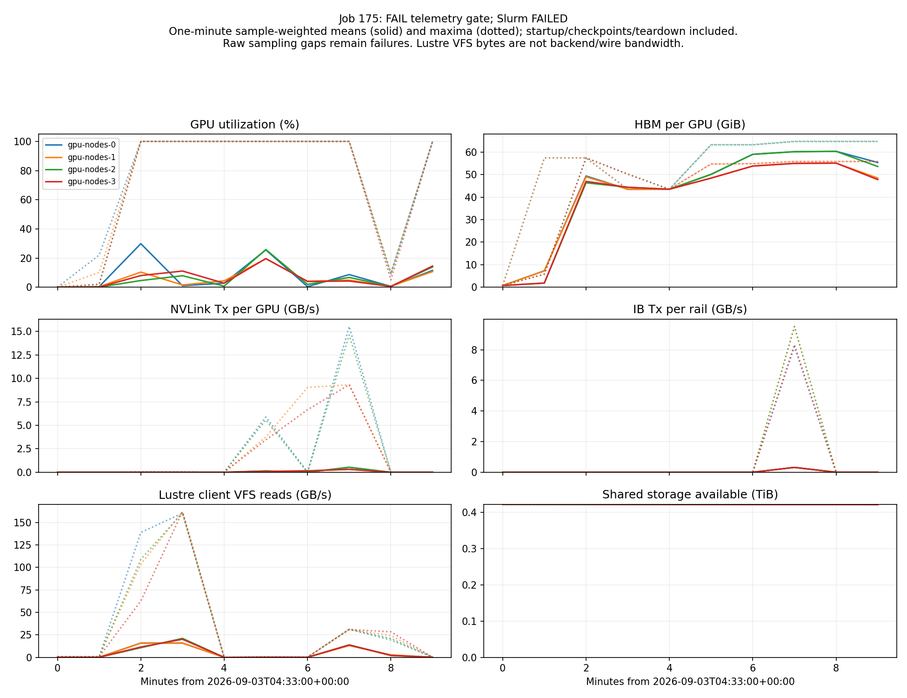

# Checkpoint and resume qualification

**Full-state resume is not qualified.** Saving a checkpoint is not proof that restart preserves the next update.

| Component | Current evidence |
|---|---|
| Model, optimizer and LR scheduler | Job175 loaded exact logical model/optimizer/scheduler state on all32 ranks. After one frozen update per replica, model weights and scheduler matched, but eight real Adam moment tensors differed. Strict next-update gate remains failed; see the component table below. |
| RNG | Job175 matched20,384 saved-RNG leaves both after load and after the frozen update. This proves equality to the stored RNG replica, not coverage of original per-expert-rank states when data_parallel_random_init=false. |
| Consumed data position and sample identities | CPU save/load preserved sample_offset, epoch_id, sample_group_index, sample_index and metadata exactly. |
| Recycled prompt buffer | Stock inherited save/load drops the buffer. Opt-in CheckpointedRolloutDataSource passed7 native CPU roundtrip/negative tests (job155), also covered in job160; not enabled in training. |
| Fully asynchronous completed-group queue and accounting | No checkpoint state API on built-in DataBuffer; buffer and window counters initialize empty/zero. Not restart-qualified. |
| Broadcast policy version | Updater initializes at zero; no corresponding checkpoint restore was found in the inspected broadcast path. Must persist it with activation state. |
| In-flight environment and scheduler state | Live asyncio tasks and sandbox processes are not serialized. A qualified checkpoint boundary must drain or explicitly account for cancellation and re-submission. |

## Historical metadata-only inspection

`training/sync-grpo-v10/checkpoints/iter_0000001` — iteration 1, saved scheduler position 32.

That inspection read only DCP metadata and small common/RNG byte ranges. See the later GPU replay below for actual load and next-update evidence.

The Megatron consumed-sample counters are zero; Miles dataset cursor state is separate. Do not interpret those fields as a resumed data position.

## Reproduced scheduler mismatch

| Configuration | Loaded position | After Miles initialization | LR |
|---|---:|---:|---:|
| use_checkpoint_opt_param_scheduler=False | 32 | 48 | 1e-06 |
| use_checkpoint_opt_param_scheduler=True | 32 | 32 | 1e-06 |

Pass --use-checkpoint-opt-param-scheduler for the controlled resume test, preserve the saved scheduler horizon and all other settings, then verify actual post-load state and the next update. Constant LR did not change in this fixture, but the scheduler counter did.

This reproduces the native scheduler plus the pinned Miles post-load branch, not a whole-model restart. The controlled GPU replay explicitly enables checkpoint-scheduler restoration.

## Frozen-input replay

Status: **FAILED 1:0; exact logical reload passed, next-update moment comparison failed**. Native CPU job **174**; GPU job **175**, 32 GPUs, 2 independent trainer replicas.

Bitwise model and real optimizer tensors, exact scheduler/RNG and class identity. Undefined same-shape/dtype native padding remains in raw evidence but is not logical optimizer state. All32 ranks must pass before either replica steps; original inputs read-only, no new checkpoint payload.

| Limitation |
|---|
| CPU fixture writer is an explicit adapter, not the training writer. |
| Full asynchronous queue/accounting, policy version and data cursor remain outside this replay. |
| Megatron saves one RNG replica when data_parallel_random_init is false; this cannot prove original per-expert-rank RNG coverage. |
| Payload file identity and small-input checksums are frozen; no whole-file checksum claim for existing497GB checkpoints. |

| Preserved failure or source finding | Scoped change |
|---|---|
| Native fixture writer synchronized CUDA with no GPUs | Fixture-only CPU synchronous writer; no package or training writer modification. |
| Premature local audit while170 was still running | Original failed audit preserved; a2 required terminal COMPLETED0:0 before final export. |
| Native ckpt_step0 is treated as false in source | Isolated read-only load view with zero-step tracker; no original checkpoint metadata edited. |
| Checkpoint file stat differed inside container; external stat matches all four worker pods. | Exact-mount CPU check matches all32 payload identities; cause unknown. Retain expected/observed stat values on any future mismatch; no comparison relaxation or checkpoint changes. |
| 192 unsupported class comparisons and391 marked padding tensors; no unexplained tensor differences. | Class identity and explicit padding semantics, proven with native CPU174. Raw failure retained; no actual parameter tolerance or runtime-package patch. |

CPU proof: `runs/vultr-b200-slurm/20260902-172037-a3b210/tests/02-resume-native-cpu-test-v5/result.json`. Submission: `runs/vultr-b200-slurm/20260902-172037-a3b210/tests/02-resume-replay-submission-v3/submission.json`.

## Job 175: exact reload, divergent next update

All 32 ranks loaded exact logical model/optimizer/scheduler/stored-RNG state. Each replica performed one frozen-input update. The next-state gate failed on eight real Adam moment tensors across four ranks; model weights, scheduler, stored RNG and iteration still matched. No tolerance was relaxed and no further update ran.

| Component | Leaves per comparison | Reload differences | Next-update differences |
|---|---:|---:|---:|
| iteration | 32 | 0 | 0 |
| model | 234,880 | 0 | 0 |
| opt_param_scheduler | 320 | 0 | 0 |
| optimizer | 218,818 | 0 | 8 |
| rng_state | 20,384 | 0 | 0 |

Counts cover both replicas and all 32 ranks. Undefined native optimizer padding is retained in raw evidence but excluded from logical state.

| Moment | Differing tensors | Largest absolute difference |
|---|---:|---:|
| exp_avg | 4 | 5.37511369e-10 |
| exp_avg_sq | 4 | 5.45050116e-15 |

The two replicas themselves differ in four next-state moment tensors. The original recipe had deterministic_mode=false. Numerical nondeterminism is a hypothesis, not a proven cause; this evidence does not establish checkpoint corruption, a Miles defect or a Vultr hardware fault.

Run a separately labeled deterministic replay control using the pinned Miles determinism controls and unchanged inputs, while retaining the original failed gate. First identify the affected parameter shards and qualify the controls on the native runtime; record unsupported deterministic kernels rather than bypassing them. A deterministic-control result cannot retroactively make job175 pass, and full async buffer/policy-version recovery still needs its own test.

Native telemetry audit passed: 24 finalized streams, 2,100,864 records, zero collector errors; maximum GPU sample gap 6.627s under the unchanged 12s deadline. This is not full required telemetry coverage or a one-second-cadence claim.

Post-job read-only inspection matched all 32 payload file identities and all 20 frozen small-input checksums. The in-worker after-state receipts were skipped on gate failure; the separate post-job check does not retroactively fill them.

Evidence: `runs/vultr-b200-slurm/20260902-172037-a3b210/tests/02-resume-replay-job175-divergence-audit-v1/result.json` (SHA256 `984fe8b0643a061f6233d145ec3a5f5bd74a8e0ac7f908b9d18218355b5db127`); `runs/vultr-b200-slurm/20260902-172037-a3b210/tests/02-resume-replay-job175-native-telemetry-audit-v1/result.json` (SHA256 `708b72d5254402504198cf4247c8b57be700808831147bc4e600a55f5912023a`); `runs/vultr-b200-slurm/20260902-172037-a3b210/tests/02-resume-replay-result-audit-v3-a1/result.json` (SHA256 `2ab61f07c803d797a5b5dc451a46dbd912edddfdd589ccec35588f44e7ab0513`); `runs/vultr-b200-slurm/20260902-172037-a3b210/tests/02-resume-replay-job175-final-evidence-v1/result.json` (SHA256 `d1682178bd6574a8f41c21eb6e4a0a31e5616522f0124cef6bf6faf330636b83`).

One-minute means and maxima, not saturation measurements. Lustre client VFS counters are not backend or wire bandwidth; see [Lustre client-statistics semantics](https://doc.lustre.org/lustre_manual.pdf#page=503). Missing full metric families and the failed replay gate remain unchanged.

## Separate deterministic control

Job **177**: **RUNNING; GPU outcome unverified**. 32 GPUs; two independent16-GPU trainer replicas, one frozen-input update each. New numerical profile, no serving or new trajectories. Original checkpoint comparisons remain strict; no historical failure is reclassified.

Settings: `deterministic_mode=True`, `NCCL_ALGO=Ring`, `NVTE_ALLOW_NONDETERMINISTIC_ALGO=0`, `CUBLAS_WORKSPACE_CONFIG=:4096:8`.

Qualification: 81 local tests and 14 native CPU checks (job 176). GPU loaded-state and next-update results are not implied by these tests.

Submission: `runs/vultr-b200-slurm/20260902-172037-a3b210/tests/02-resume-replay-submission-v4/submission.json`.

## Job173 loaded-state evidence

The original gate remains **failed** and no update ran. Counts include both replicas and all32 ranks; bytes are not unique model capacity.

| Component | Compared leaves | Raw failed leaves |
|---|---:|---:|
| iteration | 32 | 0 |
| model | 234,880 | 0 |
| opt_param_scheduler | 320 | 0 |
| optimizer | 218,818 | 583 |
| rng_state | 20,384 | 0 |

Failed leaves: 192 unsupported class comparisons; 391 explicitly marked optimizer-padding tensors; 0 unexplained differences.

Native source creates this padding with `torch.empty` and discards it during optimizer restore. The revised harness retains raw padding comparisons, excludes only same-shape/same-dtype marked padding from its logical-state gate, and compares classes by identity. Real tensors remain bitwise-gated.

Audit: `runs/vultr-b200-slurm/20260902-172037-a3b210/tests/02-resume-replay-job173-component-audit-v1/result.json`.

## Remaining requirements

- Verify model, optimizer, scheduler and RNG state in a completed checkpoint, including load/next-update comparison on identical frozen samples.
- Preserve and restore recycled prompts, completed groups, version counters and lifetime accounting, or explicitly quiesce and prove none remain.
- Atomically publish a complete state manifest only after all checkpoint components are durable and hashed.
- Demonstrate exact submitted/completed/trained/retried/stale/failed accounting across a restart; never silently reset policy version or the data cursor.

## Evidence

- Dataset cursor probe: `runs/vultr-b200-slurm/20260902-172037-a3b210/tests/02-resume-surface-probe-v1/result.json`.
- Cursor/buffer candidate: `runs/vultr-b200-slurm/20260902-172037-a3b210/tests/02-data-source-resume-test-v1/result.json`.
- Cursor/buffer candidate: `runs/vultr-b200-slurm/20260902-172037-a3b210/tests/02-data-source-resume-test-v1/results.xml`.
- Saved-state inspection: `runs/vultr-b200-slurm/20260902-172037-a3b210/tests/02-checkpoint-resume-metadata-v10-step1-a2/result.json`; SHA256 `a3ad4e32339542e60b032c68bfc1c2815079d587576f88193313413e36206ac0`.
- Saved-state inspection: `runs/vultr-b200-slurm/20260902-172037-a3b210/tests/02-checkpoint-resume-metadata-v10-step1-a4/result.json`; SHA256 `9645c0020b0f77c499b3f6548f236c3a7668e618811d91281199d2ec4e3bbca2`.
- Scheduler replay: `runs/vultr-b200-slurm/20260902-172037-a3b210/tests/02-checkpoint-scheduler-replay-v10-step1-a2/result.json`; SHA256 `96d1c901c4979130a15ff330b68b4d8f824fa81d4defc85f79d1786db2d57066`.
