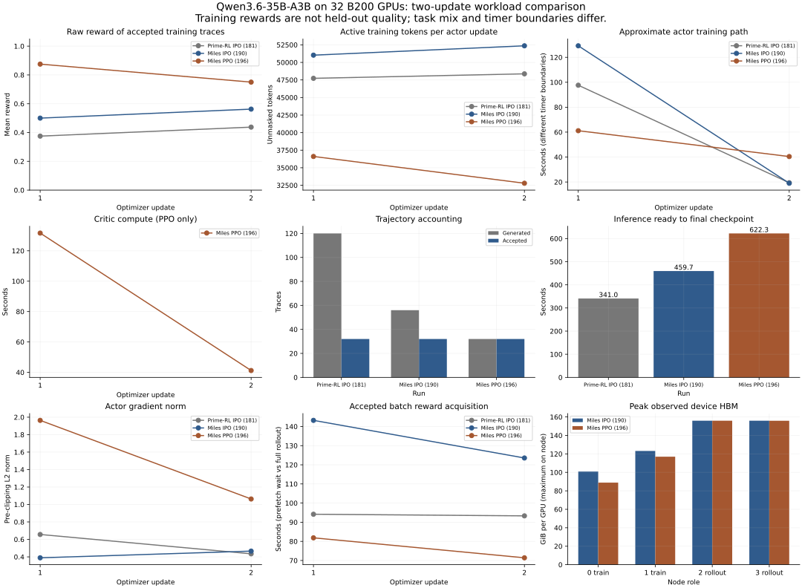
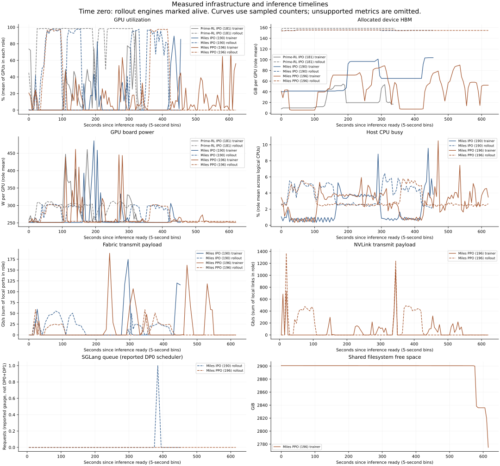
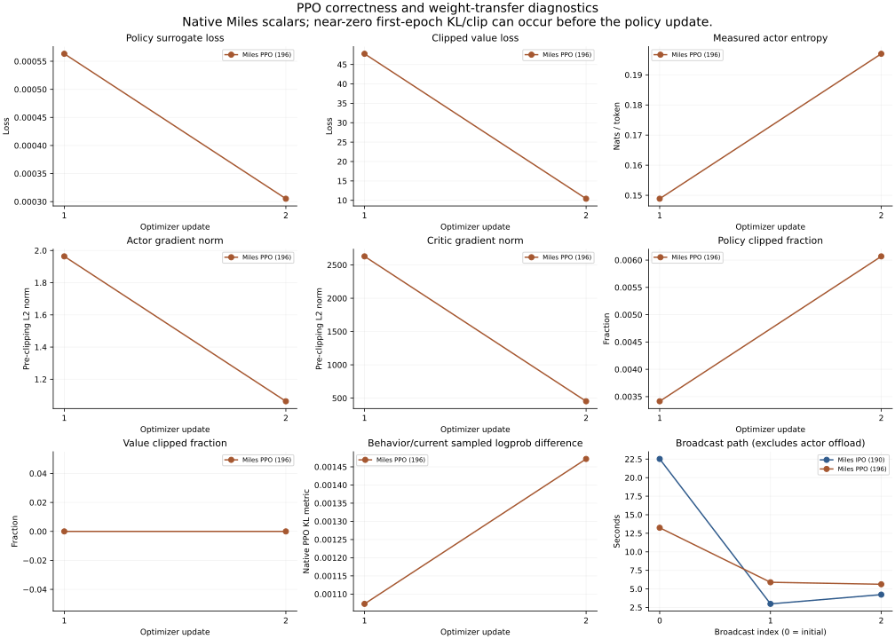

# PPO comparison with the previous Miles run

two-update matched-workload smoke tests, not a quality or speedup claim.

The PPO repeat logged **2 actor and 2 critic updates**. Inference-ready to final checkpoint was **622.28 s**, versus **459.65 s** for Miles IPO (+35.4%). This is an observed run difference, not an isolated PPO-versus-IPO speed penalty.

PPO generated 32 episodes / 69,402 output tokens; IPO generated 56 / 133,942. Both consumed 32 accepted traces. PPO added 172.87 s of logged critic compute and 160.57 s of model sleep/wake transitions across the full driver lifecycle. These timers have different boundaries and are not an additive critical-path decomposition.

## Results

The plots and this report are generated from [comparison.json](comparison.json) and [timeseries.csv](timeseries.csv).

### Miles IPO (190)

Status: **ok**. The archive contains 2 accepted rollout batches, 56 generated episodes and 32 accepted traces. Logged optimizer steps: **2 actor / 0 critic**. Episode errors: 0.

Raw evidence: `/campaign/runs/job-190`. Plot window: rollout engine mark_alive to last actor/critic save_model end.

- Update 1: raw reward 0.5000; 51,030 active tokens; 143.21 s of rollout; tasks task_14118, task_10753.
- Update 2: raw reward 0.5625; 52,362 active tokens; 123.55 s of rollout; tasks task_14118, task_10753.

Zero-variance reward groups: 3 generated; 0 accepted. Traces consumed by logged actor steps: 32.

Per-task generated-episode rewards (not held-out evaluations):

- `task_06652`: 1.0000 mean reward across 16 episodes; 0 accepted traces.
- `task_09467`: 1.0000 mean reward across 8 episodes; 0 accepted traces.
- `task_10753`: 0.5000 mean reward across 16 episodes; 16 accepted traces.
- `task_14118`: 0.5625 mean reward across 16 episodes; 16 accepted traces.

Inference ready to final save: **459.65 seconds**.

Episode duration: median 43.40 s; p95 79.94 s; p99 81.10 s; maximum 81.16 s.

Trainer GPU utilization over the plotted window: **8.51%** (mean of node means, not achieved FLOP utilization).

Rollout GPU utilization over the plotted window: **41.45%** (mean of node means, not achieved FLOP utilization).

Observed GPU utilization extremes: `gpu-nodes-0/GPU-042b468a-5f46-4b8f-c659-2be865525f4a` at 4.89% mean; `gpu-nodes-3/GPU-70057fe0-55a2-08ba-bd16-da3d25751a7f` at 42.78% mean. Role differences matter; these are descriptive outliers, not hardware fault labels.

actor checkpoint: 64.64 GiB, 3 finite small tensors loaded on CPU; Base-weight deltas were not measured for this historical checkpoint. This is structural/sample validation, not full-state resume validation.

Collector-error counts inside the plotted window: `{"gpu-nodes-0:rdma:mlx5_5": 45, "gpu-nodes-0:rdma:mlx5_6": 45, "gpu-nodes-0:rdma:mlx5_7": 45, "gpu-nodes-0:rdma:mlx5_8": 45, "gpu-nodes-1:rdma:mlx5_5": 45, "gpu-nodes-1:rdma:mlx5_6": 45, "gpu-nodes-1:rdma:mlx5_7": 45, "gpu-nodes-1:rdma:mlx5_8": 45, "gpu-nodes-2:rdma:mlx5_5": 45, "gpu-nodes-2:rdma:mlx5_6": 45, "gpu-nodes-2:rdma:mlx5_7": 45, "gpu-nodes-2:rdma:mlx5_8": 45, "gpu-nodes-3:rdma:mlx5_5": 45, "gpu-nodes-3:rdma:mlx5_6": 45, "gpu-nodes-3:rdma:mlx5_7": 45, "gpu-nodes-3:rdma:mlx5_8": 45}`.

### Miles PPO (196)

Status: **ok**. The archive contains 2 accepted rollout batches, 32 generated episodes and 32 accepted traces. Logged optimizer steps: **2 actor / 2 critic**. Episode errors: 0.

Raw evidence: `/shared/clustermax-campaigns/miles-ppo-terminal-lego-20260904T005533Z/runs/job-196`. Plot window: rollout engine mark_alive to last actor/critic save_model end.

- Update 1: raw reward 0.8750; 36,607 active tokens; 81.84 s of rollout; tasks task_06652, task_14118.
- Update 2: raw reward 0.7500; 32,795 active tokens; 71.41 s of rollout; tasks task_10753, task_09467.

Zero-variance reward groups: 2 generated; 2 accepted. Traces consumed by logged actor steps: 32.

Per-task generated-episode rewards (not held-out evaluations):

- `task_06652`: 1.0000 mean reward across 8 episodes; 8 accepted traces.
- `task_09467`: 1.0000 mean reward across 8 episodes; 8 accepted traces.
- `task_10753`: 0.5000 mean reward across 8 episodes; 8 accepted traces.
- `task_14118`: 0.7500 mean reward across 8 episodes; 8 accepted traces.

Inference ready to final save: **622.28 seconds**.

Episode duration: median 44.86 s; p95 78.96 s; p99 80.70 s; maximum 80.74 s.

Trainer GPU utilization over the plotted window: **9.66%** (mean of node means, not achieved FLOP utilization).

Rollout GPU utilization over the plotted window: **18.50%** (mean of node means, not achieved FLOP utilization).

Observed GPU utilization extremes: `gpu-nodes-0/GPU-28ee82ef-4f26-3d9f-8596-ff87f1eb443c` at 6.89% mean; `gpu-nodes-3/GPU-11d63c84-1166-0a29-92d4-cd3dd5761a86` at 19.50% mean. Role differences matter; these are descriptive outliers, not hardware fault labels.

actor checkpoint: 64.64 GiB, 6 finite small tensors loaded on CPU; 187 changed elements in sampled tensors versus base. This is structural/sample validation, not full-state resume validation.

critic checkpoint: 63.69 GiB, 6 finite small tensors loaded on CPU; 187 changed elements in sampled tensors versus base. This is structural/sample validation, not full-state resume validation.

Collector-error counts inside the plotted window: `{"gpu-nodes-0:health": 1, "gpu-nodes-0:lustre": 118, "gpu-nodes-0:rdma:mlx5_5": 61, "gpu-nodes-0:rdma:mlx5_6": 61, "gpu-nodes-0:rdma:mlx5_7": 61, "gpu-nodes-0:rdma:mlx5_8": 61, "gpu-nodes-1:lustre": 118, "gpu-nodes-1:nvlink": 2, "gpu-nodes-1:rdma:mlx5_5": 61, "gpu-nodes-1:rdma:mlx5_6": 61, "gpu-nodes-1:rdma:mlx5_7": 61, "gpu-nodes-1:rdma:mlx5_8": 61, "gpu-nodes-2:lustre": 116, "gpu-nodes-2:rdma:mlx5_5": 60, "gpu-nodes-2:rdma:mlx5_6": 60, "gpu-nodes-2:rdma:mlx5_7": 60, "gpu-nodes-2:rdma:mlx5_8": 60, "gpu-nodes-3:lustre": 118, "gpu-nodes-3:rdma:mlx5_5": 61, "gpu-nodes-3:rdma:mlx5_6": 61, "gpu-nodes-3:rdma:mlx5_7": 61, "gpu-nodes-3:rdma:mlx5_8": 61}`.

## Failures and attribution

The successful comparison excludes failed attempts; their cost and failure phases remain in the JSON and [intervention log](interventions.json). Job 195 reached a critic step but had a zero-gradient, uniform-output actor and was deliberately stopped. It is not evidence of PPO learning. Configuration/staging failures and the actor offload lifecycle defects are not attributed to Vultr hardware.

- Job 191: exit 1; 0 actor / 0 critic step calls; zero accepted valid actor updates.
- Job 192: exit 1; 0 actor / 0 critic step calls; zero accepted valid actor updates.
- Job 193: exit 1; 0 actor / 0 critic step calls; zero accepted valid actor updates.
- Job 194: exit 1; 0 actor / 0 critic step calls; zero accepted valid actor updates.
- Job 195: exit 1; 1 actor / 1 critic step calls; zero accepted valid actor updates.

Native PPO adds critic forward/backward work and actor/critic offload transitions. The synchronous recipe serializes environment rollouts and optimizer work; trainer waiting and rollout idle periods are expected. Low whole-window GPU utilization does not by itself diagnose weak GPUs or fabric. Use the preserved timers, per-node variability and link counters to distinguish time spent waiting from compute. These short runs do not establish a storage/fabric bandwidth ceiling or a statistically reliable framework speedup.

### Other allocation after this run

The post-run queue snapshot was `197|RUNNING|gpu-nodes-[0-3]`. This is not the completed PPO allocation. Our job containers were stopped and GPU UUIDs reconciled. The cluster was subsequently allocated to another job; do not claim it remained globally idle. Post-run hashing is outside this run's measured window but can overlap another allocation's startup.

### Allocation accounting

Slurm allocation durations include startup and cleanup. Failed attempts are not included in the successful-run charts.

- Job 191: FAILED, elapsed 00:01:30, exit 1:0.
- Job 192: FAILED, elapsed 00:04:14, exit 1:0.
- Job 193: FAILED, elapsed 00:07:26, exit 1:0.
- Job 194: FAILED, elapsed 00:01:03, exit 1:0.
- Job 195: CANCELLED by 0, elapsed 00:10:30, exit 0:0.
- Job 196: COMPLETED, elapsed 00:18:21, exit 0:0.

## Interpretation and limits

- **reward:** Raw accepted training reward, task mix changes after algorithm-dependent admission; not held-out evaluation.
- **ppo:** Learned critic, native mask-aware GAE; raw rewards; gamma=lambda=1; whitened advantages; clipped policy/value loss.
- **ipo:** Centered group rewards with zero-advantage filtering. Its custom entropy metric is a zero placeholder, not measured entropy.
- **memory:** nvidia-smi device allocated HBM, distinct from trainer peak allocator memory.
- **ib:** PMA counters use four-byte units. Rates are counter differences / elapsed time. Each port is separate; TX/RX are not added together.
- **time:** Different framework timer boundaries, compilation/cache state, and generated work prevent an isolated loss-function speedup claim.
- **missing:** Omitted/null, never converted to zero. Unsupported collectors and missing historical measurements are listed.
- **checkpoints:** Weights-only. No optimizer/RNG/scheduler resume fidelity claim.
- **weight_transfer:** update_weights timers include the native broadcast path but exclude the separately recorded actor wake_up/sleep transfers.
- **sglang_scope:** The node-3 serving endpoint exposes DP0 scheduler gauges and API-level token counters. Do not interpret the queue gauge as a complete DP0+DP1 queue.
- **staleness:** Synchronous Miles driver, one actor update per batch. Fully asynchronous queue/staleness benchmark not performed.
- **summary_statistics:** Linearly interpolated sample quantiles; population CV. Samples are correlated, not independent benchmark repetitions.

## Missing or unperformed measurements

- No held-out TB2.1 evaluation or quality confidence interval.
- No full ClusterMAX destructive/burn-in or collectives sweep was requested for this matched repeat.
- Historical job190 lacks continuous NVLink payload and Lustre client counters.
- PMA failures, Lustre permissions, and unsupported GPU fields remain collector errors.
- SGLang histograms are retained; no fabricated per-request TTFT/ITL from aggregate end-to-end times.
- DP1 scheduler gauges are not exposed in the retained single-endpoint scrape; GPU/fabric collectors cover both rollout nodes.
- No MTP in matched job190 recipe; MTP acceptance is not applicable.

## Evidence retention

Each phase records command arguments, exit status, duration, and raw-log SHA-256. All TensorBoard scalar series, compact task-level episode records, GPU/node/link sample statistics, and collector errors are consolidated in the JSON. The CSV retains sampled node/engine timelines. Full token transcripts, model/checkpoint shards, repeated process logs, and raw collector output remain in checksummed local and cluster archives, outside Git. No held-out improvement is inferred from these two training rewards.
