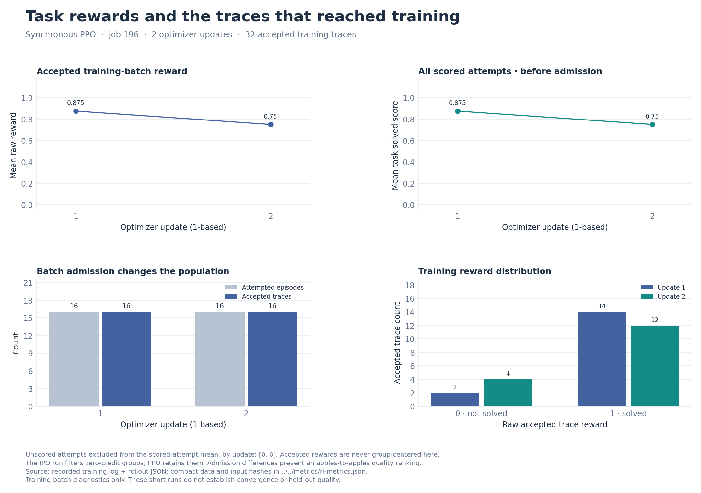
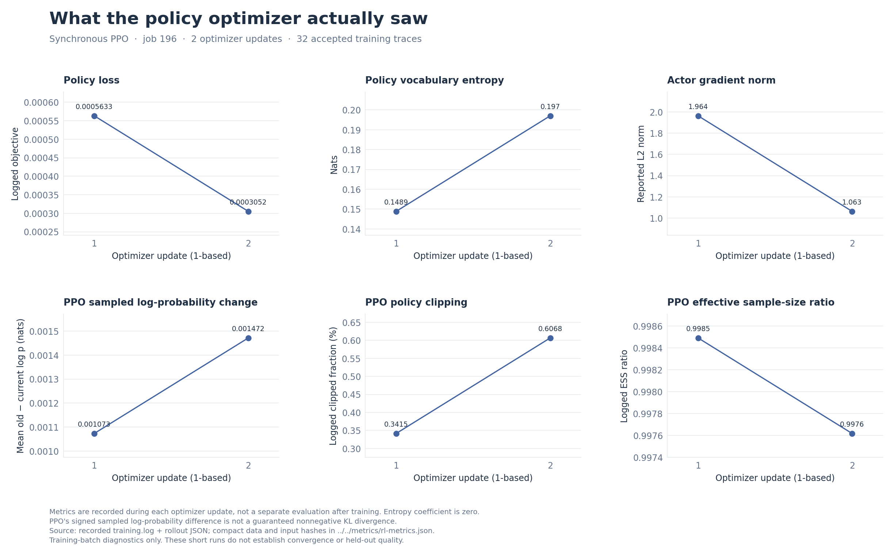
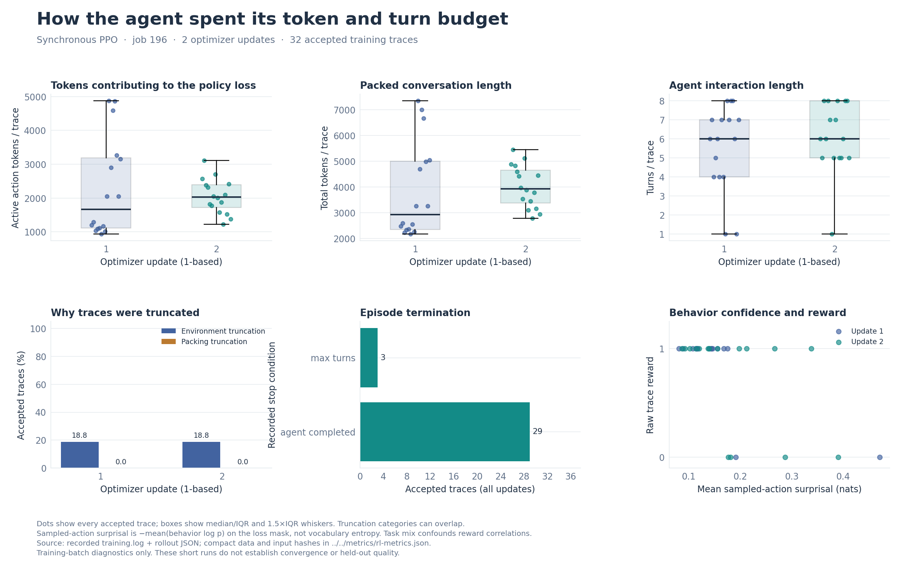
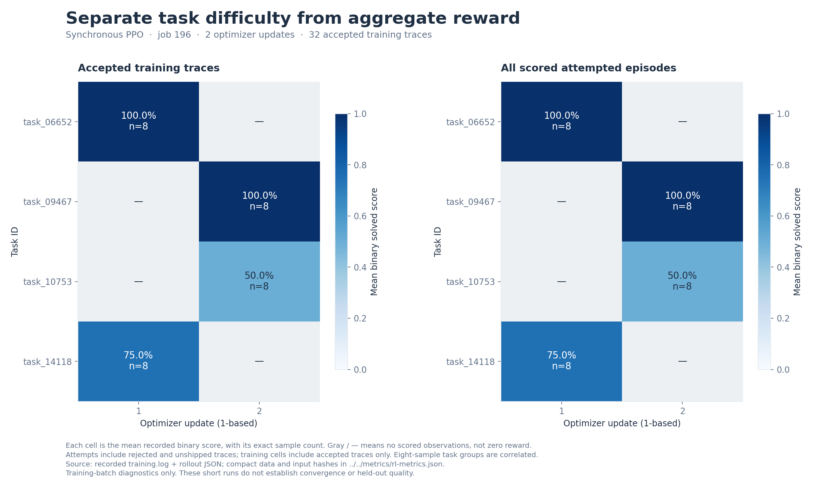
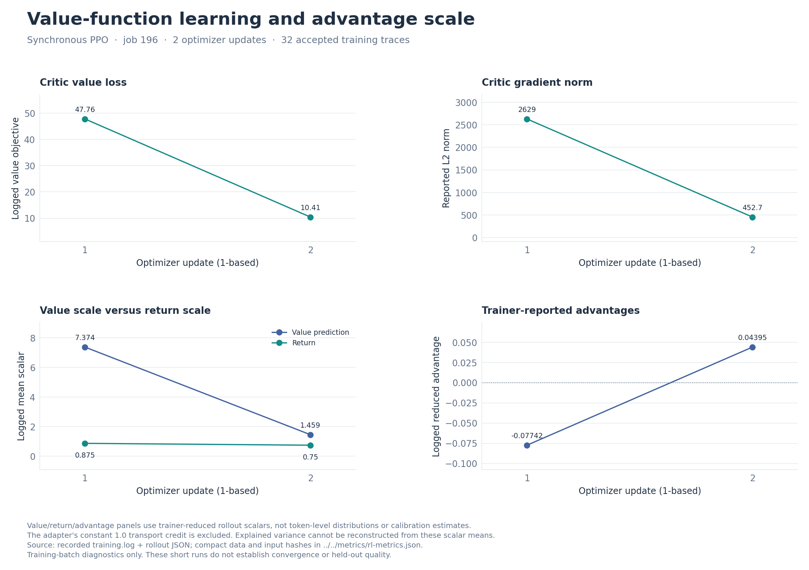

# RL charts — Synchronous PPO, job 196

2 recorded updates. Charts use **training batches**, not held-out evaluation. Displayed update 1 corresponds to raw log step 0.

Regenerate from the repository root with `python3 comparison-infrastructure/rl_charts.py` (Matplotlib and NumPy required). The shared renderer accepts explicit paths for future runs; no raw logs or source trees are duplicated.

Compact inputs and source hashes: [rl-metrics.json](../../metrics/rl-metrics.json). Output hashes: [manifest.json](manifest.json).

## Rewards And Admission

[Download SVG](01-rewards-and-admission.svg)

## Policy Optimization

[Download SVG](02-policy-optimization.svg)

## Rollout Behavior

[Download SVG](03-rollout-behavior.svg)

## Task Outcomes

[Download SVG](04-task-outcomes.svg)

## Critic Learning

[Download SVG](05-critic-learning.svg)

## Interpretation and missing metrics

- 1-based display; raw log step/rollout IDs are zero-based

- Raw accepted-trace reward; training batch, not held-out evaluation

- All serialized attempted episodes, including errors/unshipped traces; missing scores are excluded explicitly

- Active action tokens from loss_mask; response span also contains tool/observation tokens

- Trainer vocabulary entropy on selected positions, not sampled-token surprisal

- Metrics evaluated during each update, not post-update evaluation; IPO and PPO objectives differ

- Logged signed old-minus-current sampled log probability; not a guaranteed nonnegative KL divergence

- Async recomputes its pre-update policy: one step can report PPO KL=0 and ESS=1 despite stale behavior/TIS

- Sync train_rollout mismatch=0 reuses behavior logprobs as its reference; not an independent mismatch measurement

- Use rollout/advantages logged by trainer; never PPO metadata.advantage (transport-only 1.0)

- Two updates and tiny, correlated task groups do not establish convergence or model-quality ranking

- Not available / not applicable: held-out evaluation

- Not available / not applicable: critic explained variance / per-token value distribution

- Not available / not applicable: full importance-weight histogram

- Not available / not applicable: reward components beyond the recorded solved score

- Not available / not applicable: TIS: not enabled in this run
